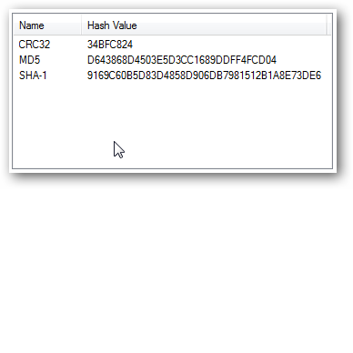

SHA-1 encryption is a hash function that takes a file, arragnes the data in a randomized manner and outputs a value in a specific number range.  This hash value is 160 bits long and is widely used as a cryptographic encryption function for storing passwords, error detection and comparing files.

For this project, I began by ensuring each piece of data was read into the program.  That included error checking, in the event the file did not exist, was entered incorrectly or was too large for my program to handle.  Afterwards, I placed each character the file contained into a character array, transmuted it into an integer array and passed it on the message digest function.  This would compute the hash value and return it to the user. 

Here is a link to the source code: akuloloia.github.io/projects/KuloloiaAnthonyFinal.cpp

