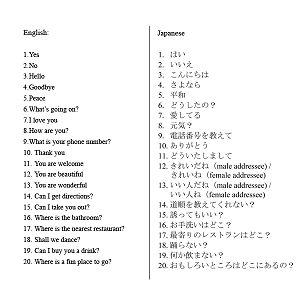

This function is quite straightforward.  It takes an unsorted input of English words translated to Japanese, sorts them alphabetically and displays it to the user in an easy to follow manner. Although simple, this program has served as the basis for a far more complex project; teach users Japanese.  As such, it ensures I am able to properly sort words within a short period of time.
